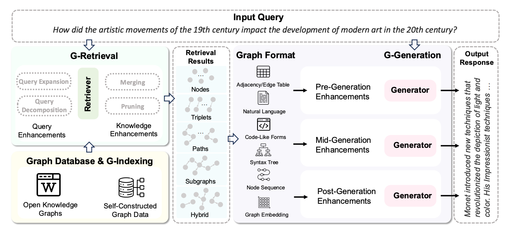

```
        ___
     __|___|__
      ('o_o')
      _\~-~/_    ______.          Tell me who's the FRAUD!
     //\__/\ \ ~(_]---'   
    / )O  O( .\/_)
    \ \    / \_/
    )/_|  |_\
   // /(\/)\ \
   /_/      \_\
  (_||      ||_)
    \| |__| |/
     | |  | |
     | |  | |
     |_|  |_|
     /_\  /_\
```

# Overview
The goal of this project is to build a Graph RAG System that allows a user to interact and play with an underlying graph via an LLM.

Expected Queries could for example be: 

- _"Who is the executive of company A and is the executive also registered as Executive for other companies?"_
- _"Which company is somehow connected to Company A"_
- _"What are the ownership networks in the Austrian manufacturing sector?"_
-  _"Which large companies share business addresses and what might this indicate?"_
- _"How are companies in different industries connected through their leadership?"_

From this point, it's straight forward to understand the utility of such system. 

# How to use
## Mac
1. Install `uv` (tested successfully with _uv inituv 0.7.19 (Homebrew 2025-07-02)_)
2. init project via `uv init`
3. Create and activate env via `uv init`


# Approach

I setup an [OpenWeb UI](https://github.com/open-webui/open-webui) as frontend and used Graph RAG in the Background.




But why not simply RAG? 


## Graph RAG

### Setup / Architeture
The proposed Architecture is split up into three phases (based on Peng et al. (2024) [^1] .)

#### Graph-based Indexing
For this stage, a self-constructed Graph has been selected. (See [Data Section](#Graph Schema))


TODO: Soll hier bei dem Graph noch was angepasst werden? 

#### Graph-based Retrieval


##### Query Enhancement
##### Retrieval Granularity
##### Retrieval Paradigm
#### Retriever
#### Knowledge Enhancement
#### Graph-enhanced Generation


# Data used
This project builds on top of an existing database that contains the following information about companies: 

| Firmenname | FNR      | Staat      | Ort      | PLZ | Straße    | Gewerbezweig   | Funktion        | Name   |      Eigenkapitalquote |      Bilanzsumme |
|:-----------|:---------|:-----------|:---------|----:|:----------|:---------------|:----------------|:-------|-----------------------:|-----------------:|
| Firma_1    | FNR_1183 | Österreich | Wien     | 4   | Straße_16 | Dienstleistung | Geschäftsführer | Name_1 |                   0.26 |      18305192.02 |
| Firma_2    | FNR_5598 | Österreich | Linz     | 10  | Straße_18 | Dienstleistung | Geschäftsführer | Name_2 |                   0.40 |      48561563.92 |
| Firma_3    | FNR_1951 | Österreich | Salzburg | 7   | Straße_8  | Handel         | Geschäftsführer | Name_3 |                   0.28 |      86135816.00 |
| Firma_4    | FNR_5668 | Österreich | Salzburg | 5   | Straße_18 | Handel         | Geschäftsführer | Name_4 |                   0.23 |      89724725.07 |
| Firma_5    | FNR_7592 | Österreich | Linz     | 4   | Straße_8  | Produktion     | Geschäftsführer | Name_5 |                   0.31 |                  |


## Tech Stack
 ### Frontend: 
I used [Kotaemon](https://github.com/Cinnamon/kotaemon) because of it's advanced Graph UI Features which are crucial for this project
On Mac, the frontend can be setup via: 
```
# To run docker with platform linux/arm64
docker run \
-e GRADIO_SERVER_NAME=0.0.0.0 \
-e GRADIO_SERVER_PORT=7860 \
-v ./ktem_app_data:/app/ktem_app_data \
-p 7860:7860 -it --rm \
--platform linux/arm64 \
ghcr.io/cinnamon/kotaemon:main-lite
```

docker run \
-e GRADIO_SERVER_NAME=0.0.0.0 \
-e GRADIO_SERVER_PORT=7860 \
-v /Users/dominikpichler/Documents/Git/BRZ/Get_RAGed/ktem_app_data:/app/ktem_app_data \
-p 7860:7860 -it --rm \
--platform linux/arm64 \
ghcr.io/cinnamon/kotaemon:main-lite

### Backend: 
For fast shipping and rapid prototyping (as well as for good compatibility with Kotaemon) I used [nano-graph-rag](https://github.com/gusye1234/nano-graphrag)


### LLM
I used llama3.1:8b

In order to work for the application, please stick to the [koteamon guide](https://cinnamon.github.io/kotaemon/local_model/)

## Graph Schema
### Nodes:
 - Firma
 - Name 
 - Adresse (Staat + Ort + PLZ + Straße)

### Edges:
- **arbeitet_bei**: connects **Name** and **Firma** 
- **hat_adresse**: connects **Firma** and **Adresse**
- **hält_beteiligung**: connects **Firma** and **Firma**

### Attributes: 
**Firma**
- FNR: _Str_
- Gewerbezweig: _str_
- Eigenkapitalquote: _float_
- Bilanzsumme: _float_
- Scheinunternehmen: _boolean_

**arbeitet_bei**:
- Funktion: _str_

**hält_beteiligung**: 
- Anteil: _float_

## References

[^1]: Boci Peng, Yun Zhu, Yongchao Liu, Xiaohe Bo, Haizhou Shi, Chuntao Hong, Yan Zhang, Siliang Tang. "Graph Retrieval-Augmented Generation: A Survey." arXiv:2408.08921 (2024). https://arxiv.org/abs/2408.08921